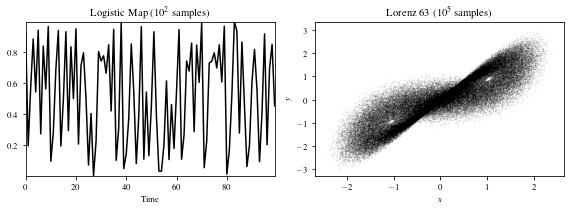
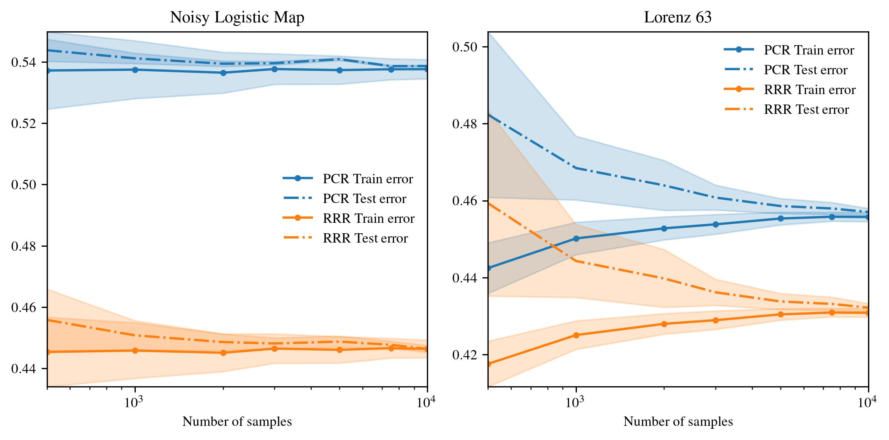
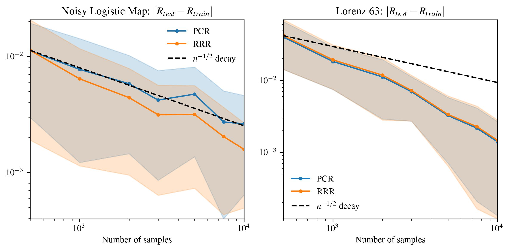
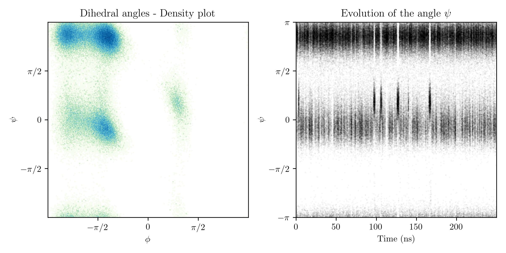
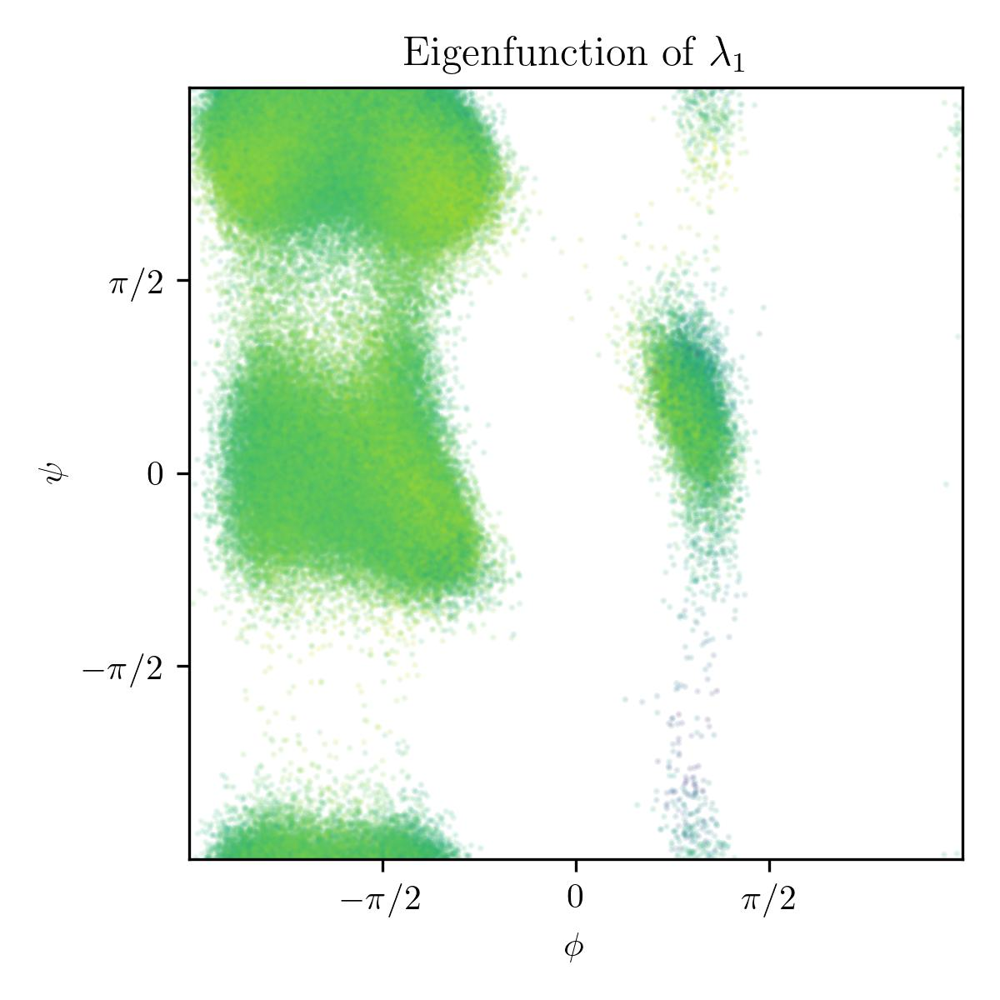
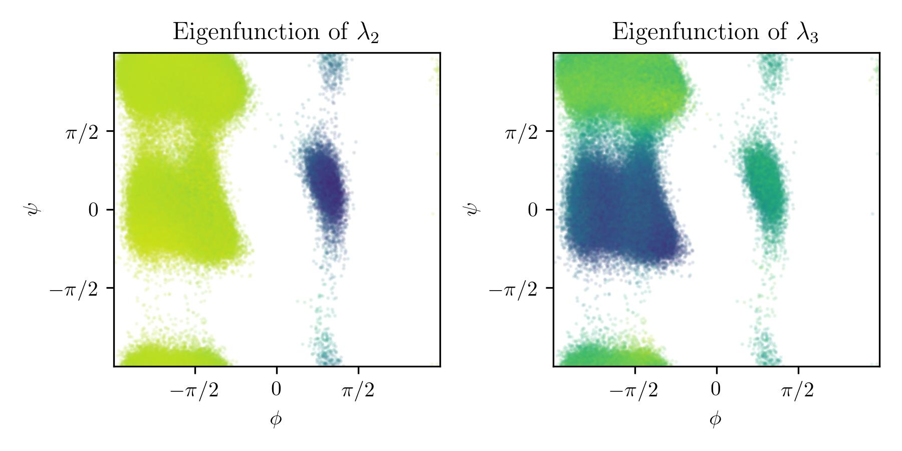

# Kooplearn: a Python package to learn the Koopman operator

## Example: noisy logistic map & Lorenz63
The noisy logistic map is defined by the equation $x_{t + 1} = 4x_{t}(1 - x_{t}) + \xi_{t}$, where $\xi_{t}$ is an additive i.i.d. noise term. The Lorenz63 system is the discretization of the differential equation $$\frac{dx}{dt} = \begin{bmatrix}\sigma(x_{2} - x_{1}) \\ x_{1}(\mu - x_{3}) \\ x_{1}x_{2} - \beta x_{3} \end{bmatrix}$$, with $\sigma = 10$, $\mu = 28$ and $\beta = 8/3$.

We have trained the Reduced Rank and Principal Component regressors on these two systems. The training and test errors as a function of the number of training behave as

Each experiment was repeated 100 times. For both systems the number of test samples is $50000$. Given the large number of test samples, the test error is a good proxy of the true risk. By subtracting train and test errors, therefore, we can empirically verify the uniform bound in Theorem 3 of the manuscript. Plotting this "excess risk" bound in log scale, it is evident that the decay is faster than $\propto n^{-1/2}$, as predicted from the theortical result.

# An example from chemistry: the molecule Alanine dipeptide.
In this example we will analyse a [simulation of the molecule Alanine dipeptide](https://markovmodel.github.io/mdshare/ALA2/#alanine-dipeptide) from the Computational Molecular Biology Group, Freie Universität Berlin (GER). 

The dataset, here, is a time series of the Alanine dipeptide atomic positions. The trajectory spans an interval of 250 nano-seconds. The number of features for each data point is 45.

For this example statistical mechanics provides quite a bit of informations:
1. The dynamics is governed by the Langevin equation, and is Markovian.
2. It exists an invariant density, dubbed the _Boltzmann distribution_ after the great physicist L. Boltzmann, one of the founding fathers of statistical mechanics. 
3. The equations are time-reversal-invariant. This implies that the Koopman operator is self-adjoint and has real eigenvalues.

For Alanine dipeptide it is well known that the dihedral angles (i.e. the ones annotated in the sketch above) play a special role, and characterize the _state_ of the molecule. Indeed, from the density plot shown below it is clear that only selected regions of the angle space are appreciably visited during the evolution of Alanine dipeptide. Broadly speaking, we can associate these regions to _metastable states_, i.e. configurations of the molecule which are "stable" over an appreciable span of time. To substantiate this claim we point to the plot in the right panel below. From this plot it is evident that when in a given region, the molecule spend a large amount of time inside it, and transitions from one region to another are quite rare. 

We now try to recover the same informations from the spectral decomposition of the Koopman operator. We train the Reduced Rank Regression estimator with rank 5 and a standard Gaussian kernel. We remark that the dataset is comprised of atomic _positions_, and not dihedral angles. We show that the computed eigenfunctions are highly correlated with the dihedral angles, meaning that our estimator was able to _learn the correct physical quantities_ starting only from the raw atomic positions.

The estimated eigenvalues are $\lambda_{1} = 0.99920$, $\lambda_{2} = 0.9177$, $\lambda_{3} = 0.4731$, $\lambda_{4} = -0.0042$ and $\lambda_{5} = -0.0252$.

Notice that they are all real (as they should be, since the system is time-reversal-invariant). The eigenfunction corresponding to the largest eigenvalue is the equilibrium eigenfunction, and should be constant everywhere.

The color in the previous plot represent the value of the eigenfunction on the trajectory points. We see that the color is quite homogeneous everywhere. This is in contrast with what happens with the other eigenfunctions, where the eigenfunctions are piecewise constant and clearly identify the metastability regions. Indeed, the plot for the eigenfunctions of $\lambda_{2}$ and $\lambda_{3}$ is

