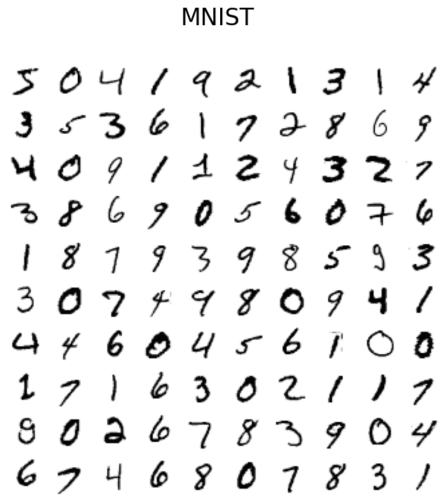

```python
from sklearn.datasets import fetch_openml
import matplotlib.pyplot as plt
```


```python
mnist = fetch_openml(data_id=554)
```


```python
images = mnist['data'].values.reshape(-1, 28, 28)
```


```python
def plot_digits(X, title):
    """Small helper function to plot 100 digits."""
    fig, axs = plt.subplots(nrows=10, ncols=10, figsize=(8, 8))
    for img, ax in zip(X, axs.ravel()):
        ax.imshow(img, cmap="Greys")
        ax.axis("off")
    fig.suptitle(title, fontsize=24)
```


```python
plot_digits(images, "MNIST")
```


    

    


```python

```
