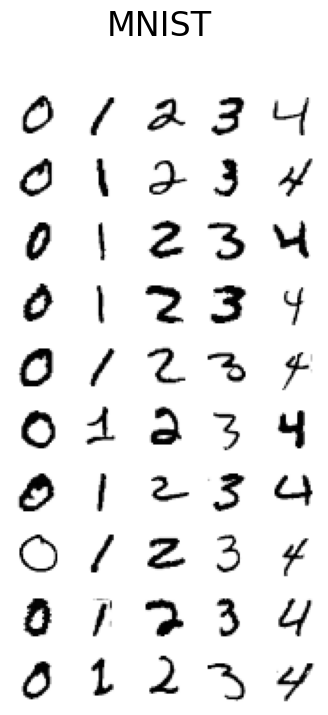

```python
from kooplearn.datasets import fetch_ordered_mnist
import matplotlib.pyplot as plt
```


```python
num_digits = 5
images, targets = fetch_ordered_mnist(num_digits=num_digits)
```


```python
def plot_digits(X, title):
    """Small helper function to plot 100 digits."""
    fig, axs = plt.subplots(nrows=10, ncols=num_digits, figsize=(0.8*num_digits, 8))
    for img, ax in zip(images, axs.ravel()):
        ax.imshow(img, cmap="Greys")
        ax.axis("off")
    fig.suptitle(title, fontsize=24)
plot_digits(images, "MNIST")
```


    

    

